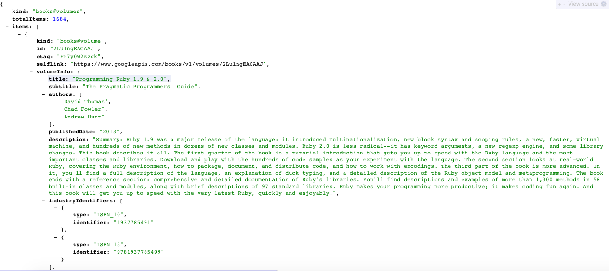

    
# Arrays and Hashes in API Data

APIs or Application Programming Interfaces are used to get and send data between apps. Think of them as a secret developer access to apps that most non-technical users would never be able to access. APIs are useful because they provide us with data and functionality that we can integrate into our own programming.


In this lab, we've set up a call to the Google Books API that returns a big hash (filled with more hashes and arrays) all related to the book Programming Ruby. We then save this to a variable called `top_tracks`. Here's the code that pulls that data from the API for us.

```ruby
#import the gems we need to pull data from an API
require 'httparty'
require 'json'
require 'pp'

# In this method we get the data from Google Books. The method returns data for the first book.

def get_data_from_api
	request_string = "https://www.googleapis.com/books/v1/volumes?q=programming+ruby" #creates a url to access API data
	sample_response = HTTParty.get(request_string) #go grab the data in the portal
	sample_parsedResponse = JSON.parse(sample_response.body, {:symbolize_names => true}) #makes data easy to read
	sample_parsedResponse[:items][0] #returns first element in items array
end
```

# Instructions

Fork and clone this lab, and run `bundle install` in the command line.

Open up the `model.rb` in your text editor and run `ruby model.rb` to see the nested hash that is returned in `books`. Then see how far you can get at parsing through this crazy nested hash of data to write code that will answer the questions in the file. There are easy, medium and hard challenges... Good luck! For your reference, the hash (in pretty form) is below:



**Note:** You may want to use `pp` (stands for pretty print) instead of `print` or `puts` - it makes the data structures much easier to see as you're working with them!

